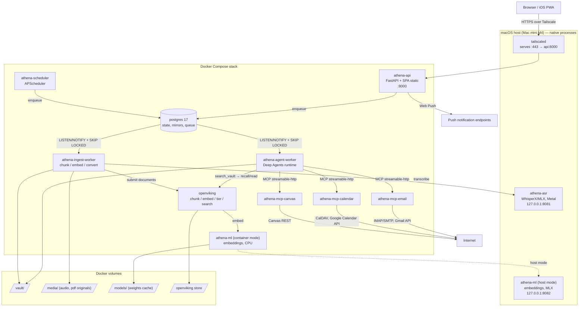

# Athena

> **Self-hosted, memory-first personal AI agent.**  
> Continuous personal daemon running on owned hardware, combining an Obsidian-compatible markdown vault, path-scoped semantic retrieval, and action-taking automations under an unbreakable human-in-the-loop approval gate.

---

## Overview

Athena is an always-on personal AI agent designed to run on hardware you control (such as a home Mac mini) and connect securely over Tailscale to your browser and mobile devices. It is a daemon that works in the background, not just an interactive chat session.

Athena fulfills three primary roles:

1. **Remember (Personal Brain)**: Continuously ingests lecture audio, slide decks, typed notes, Canvas LMS files, email, and calendar events into a plain-markdown vault. Answers questions with exact citations back to original materials and abstains when no grounded evidence exists.
2. **Act (Controlled Effects)**: Reads and drafts email, schedules calendar events, and inspects coursework through isolated Model Context Protocol (MCP) servers. Every external write action is strictly gated by an interrupt-driven approval queue.
3. **Remind (Deterministic Automations)**: Tracks assignments, due dates, and flagged communications using deterministic Python logic to deliver timely digests and lead-time reminders to desktop and mobile devices via Web Push.

---

## Key Features

- **Markdown-First Knowledge Base**: The plain-markdown Obsidian-compatible vault is the sole source of truth ([I-01](docs/02-invariants.md#i-01)). The OpenViking vector index is derived and disposable.
- **Path-Scoped Semantic Retrieval**: OpenViking scopes search by hierarchical directory path prefixes (e.g., `courses/<slug>/lectures/YYYY/MM/`) before ranking, matching lecture context by course and date without cross-topic noise.
- **Context-Preserving Subagent Synthesis**: Retrieval tool returns compact pointers and offloads full chunk text to subagents ([I-09](docs/02-invariants.md#i-09)), preventing main conversation thread context exhaustion.
- **Unbreakable Approval Boundary**: Actions with external consequences (sending emails, modifying calendar events) trigger LangGraph interrupts, write checkpoint state to PostgreSQL, and notify your phone via Web Push. No write executes without explicit approval ([I-03](docs/02-invariants.md#i-03), [I-08](docs/02-invariants.md#i-08)).
- **Credential-Isolated Integrations**: Distinct MCP containers for Email, Calendar, and Canvas isolate secrets and limit blast radius ([01-architecture.md](docs/01-architecture.md#why-three-mcp-containers-not-one)).
- **Deterministic Work Stays Deterministic**: Date comparisons, polling, diffing, and lead-time calculations run in pure Python without LLM hallucination risk ([I-11](docs/02-invariants.md#i-11)).
- **Apple Silicon Hardware Acceleration**: Hybrid deployment supporting native macOS Metal/MLX processes on the host for high-throughput local WhisperX ASR alongside a containerized Docker Compose stack.

---

## Architecture Topology



---

## Core Invariants

Athena enforces strict engineering rules defined in [`docs/02-invariants.md`](docs/02-invariants.md). Any change violating these is rejected:

| Invariant | Principle | Enforcement Mechanism |
|---|---|---|
| **I-01** | **Vault is the source of truth** | Index is disposable; `just reindex --from-scratch` fully restores search without loss. |
| **I-02** | **Source text is never paraphrased** | Ingestion preserves verbatim wording; raw audio and PDFs are kept in `media/`. |
| **I-03** | **Every effect passes approval** | Write tools require entry in `config/approvals.toml` and trigger interrupt before execution. |
| **I-04** | **Filesystem is strictly fenced** | Agent filesystem tools cannot access anything outside the configured vault root. |
| **I-05** | **Ground or abstain** | Synthesis requires explicit vault citations or must explicitly state nothing was found. |
| **I-06** | **Nothing tunable is hardcoded** | All prompts, models, thresholds, timeouts, and paths live in `config/`. |
| **I-07** | **Secrets live in environment only** | Secrets are referenced by variable name in config; never committed, logged, or sent to models. |
| **I-08** | **Persist before you execute** | Effect intent and outcome are committed to Postgres with idempotency keys. |
| **I-09** | **Retrieved content stays off main thread** | Search returns compact hits; full chunk reading is delegated to isolated subagents. |
| **I-10** | **Multi-user ready schema** | `user_id` is mandatory across all repository queries. |
| **I-11** | **Deterministic work stays deterministic** | Automation engine does not invoke LLMs for mechanical arithmetic or date diffs. |
| **I-12** | **Degrade closed** | Failures on effect or retrieval paths abort safely without fallback guessing. |
| **I-13** | **UTC in storage, local at edges** | All database timestamps are `TIMESTAMPTZ` in UTC. |
| **I-14** | **Tests never touch live accounts** | Network guard in test harness forbids live service calls. |
| **I-15** | **Agent cannot alter approval rules** | Approval configuration is immutable to agent tools. |

---

## Repository Structure

```
athena/
├── AGENTS.md                       # Rules and guidelines for coding agents
├── docs/                           # Architecture, specifications, and phase plans
│   ├── 00-product.md               # Product scope, MVP goals, glossary
│   ├── 01-architecture.md          # System topology and component design
│   ├── 02-invariants.md            # Non-negotiable architectural rules
│   ├── 03-decisions.md             # Architecture decision records (ADRs)
│   ├── ...                         # Detailed module design docs
│   └── phases/                     # 16-phase step-by-step build sequence
├── config.example/                 # Committed configuration templates
│   ├── server.toml                 # API and server settings
│   ├── agent.toml                  # Agent graph, prompts, and model routing
│   ├── retrieval.toml              # OpenViking and search settings
│   ├── ingestion.toml              # Ingestion pipeline and converter settings
│   ├── accounts.toml               # Email, Calendar, and Canvas credentials
│   ├── vault.toml                  # Vault layout and schema definitions
│   ├── approvals.toml              # Tool interrupt and auto-approval policies
│   ├── reminders.toml              # Reminder schedules and lead times
│   ├── notifications.toml          # Web Push and alert channels
│   └── schedules.toml              # Periodic cron and poll interval rules
├── docker/                         # Docker Compose configurations and Dockerfiles
├── host/                           # Native macOS services (ASR, MLX) & launchd plists
├── migrations/                     # Alembic database migrations
├── src/athena/                     # Core Python package
│   ├── config/                     # Configuration loader, schema, and hot reload
│   ├── db/                         # PostgreSQL engine, models, and repositories
│   ├── queue/                      # Postgres transactional queue with LISTEN/NOTIFY
│   ├── vault/                      # Vault bootstrap, frontmatter, and path fencing
│   ├── ingestion/                  # Converters (audio, pdf, markdown, canvas, email)
│   ├── retrieval/                  # Scoped retrieval, Viking client, synthesis
│   ├── agent/                      # Deep Agents graph, subagents, and tools
│   ├── approvals/                  # Interrupt handling and approval queue
│   ├── automations/                # Deterministic pollers and reminder engine
│   ├── notifications/              # Web push delivery
│   ├── api/                        # FastAPI routers, auth, SSE streaming
│   ├── mcp/                        # MCP servers (Email, Calendar, Canvas)
│   ├── ml/                         # Local embedding service
│   └── observability/              # Structured logging and audit trail
├── web/                            # React SPA frontend / PWA
└── tests/                          # Unit, integration, acceptance tests & fixtures
```

---

## Documentation & Phased Build Sequence

Detailed technical documentation is available in [`docs/`](docs/README.md).

The implementation progresses through 16 structured phases, each verified by an explicit exit gate:

| Phase | Description | Exit Gate |
|---|---|---|
| [**00 — Foundations**](docs/phases/phase-00-foundations.md) | Repo, toolchain, CI, test harness | `just check` passes on clean clone |
| [**01 — Configuration**](docs/phases/phase-01-configuration.md) | Pydantic schema, TOML loading, hot reload | Config loads, validates, and reloads |
| [**02 — Database**](docs/phases/phase-02-database.md) | PostgreSQL schema, Alembic, queue | Migrations clean; queue concurrency verified |
| [**03 — Harness**](docs/phases/phase-03-harness.md) | Deep Agents graph, checkpoints, durability | Mid-run interrupt and resume without duplication |
| [**04 — Vault**](docs/phases/phase-04-vault.md) | Vault bootstrap, frontmatter, filesystem fencing | Fencing blocks reads/writes outside vault root |
| [**05 — ML Services**](docs/phases/phase-05-ml-services.md) | Embedding & WhisperX ASR services | Metal host & container CPU endpoints respond |
| [**06 — Ingestion**](docs/phases/phase-06-ingestion.md) | Ingestion pipeline (audio, PDF, markdown, Canvas) | Media files converted and written to vault |
| [**07 — Retrieval**](docs/phases/phase-07-retrieval.md) | OpenViking index & scoped recall | Recall and precision meet acceptance threshold |
| [**08 — API**](docs/phases/phase-08-api.md) | FastAPI backend, auth, SSE streaming | Authenticated streaming chat over HTTP |
| [**09 — Web UI**](docs/phases/phase-09-spa.md) | React SPA / PWA (chat, vault, approvals) | Interactive chat, vault browsing, and UI flows |
| [**10 — Approvals**](docs/phases/phase-10-approvals.md) | Approval queue, interrupts, Web Push | Interrupt sends push and blocks until decision |
| [**11 — MCP Read**](docs/phases/phase-11-mcp-read.md) | Read-only MCP servers (Email, Calendar, Canvas) | External data fetched without write tools |
| [**12 — MCP Write**](docs/phases/phase-12-mcp-write.md) | Write-capable MCP tools under approval | Rejection cancels write; approval executes effect |
| [**13 — Automations**](docs/phases/phase-13-automations.md) | Scheduler, pollers, and reminder engine | Reminders trigger deterministically on schedule |
| [**14 — Assignments**](docs/phases/phase-14-assignments.md) | Coursework context assembly & study/draft modes | Study mode gates output; context assembled |
| [**15 — Deployment**](docs/phases/phase-15-deployment.md) | Compose stack, launchd daemons, Tailscale | Stack starts and recovers unattended after reboot |

---

## Toolchain & Development

- **Python**: 3.12+ managed with [`uv`](https://github.com/astral-sh/uv)
- **Task Runner**: [`just`](https://github.com/casey/just)
- **Linter & Formatter**: [`ruff`](https://github.com/astral-sh/ruff) (`select = ["ALL"]`)
- **Type Checking**: [`mypy`](https://github.com/python/mypy) (`--strict`)
- **Testing**: [`pytest`](https://pytest.org) (100% branch coverage required)

### Common Commands

```bash
# Run linting, type checks, and tests
just check

# Run test suite with coverage
just test

# Start local infrastructure dependencies (Postgres, ML)
just dev-up

# Start local dev environment
just run
```

---

## License

This project is licensed under the [MIT License](LICENSE).
