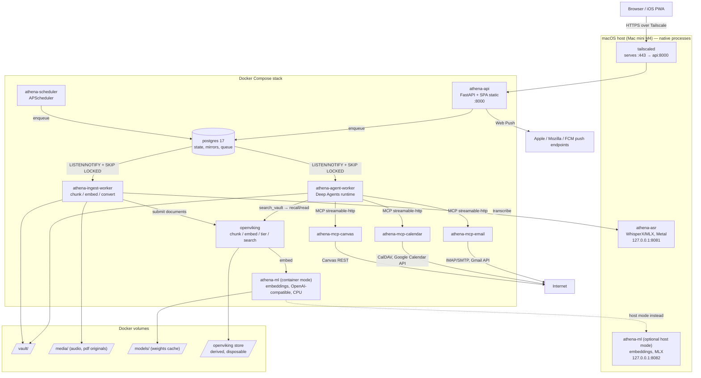
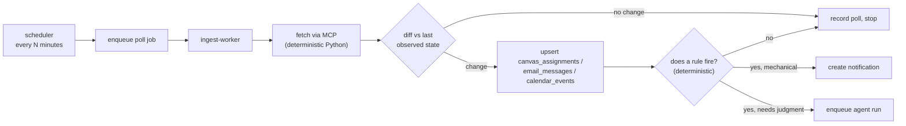
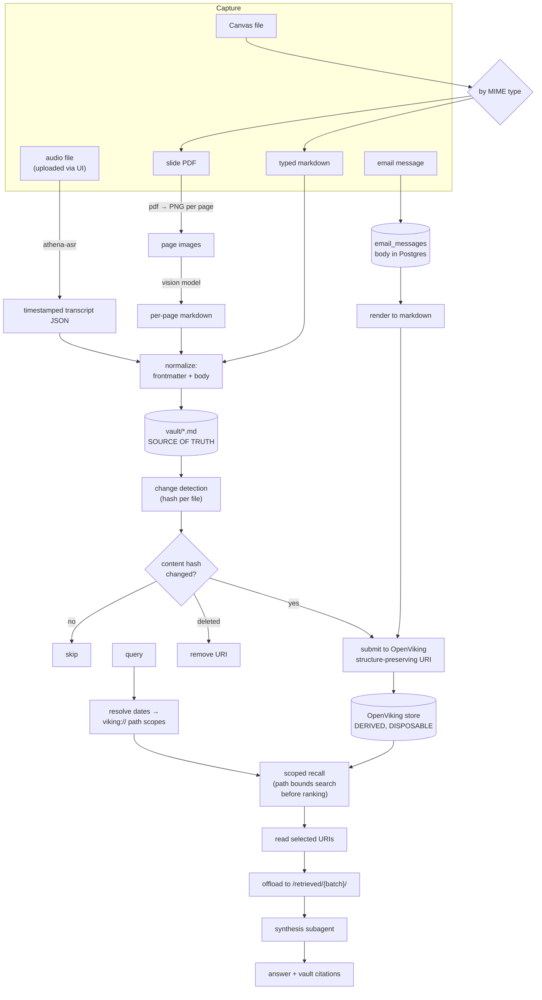

# 01 — Architecture

## Topology



## Why this shape

### Why the workers are separate from the API

An agent turn can run for minutes: many model calls, MCP round trips, retrieval. An
ingestion job can run for tens of minutes: transcription, per-page vision calls,
embedding. Neither can sit inside a request handler. The API's job is to accept work,
stream results, and answer questions about state — it must stay responsive while a
90-minute lecture is being processed.

Agent runs and ingestion are two worker *deployments from one image*, subscribed to
different job queues. They are separated because ingestion saturates CPU and would
otherwise add latency to interactive chat.

### Why Postgres is the queue, not Redis

The queue is a table plus `SELECT ... FOR UPDATE SKIP LOCKED` plus `LISTEN`/`NOTIFY`
for wakeup. This is not a compromise; it is the correct choice here for three reasons:

1. **Transactional enqueue.** Creating an approval record and enqueueing the
   notification that announces it must be atomic. With Redis they are two systems and
   you get to write reconciliation code. With Postgres it is one `COMMIT`.
2. **One stateful service.** Every additional stateful container is another backup
   story, another failure mode, another thing to restore after a power cut.
3. **Throughput is irrelevant.** Athena's peak load is a few hundred jobs a day.
   `SKIP LOCKED` handles orders of magnitude more than that.

`LISTEN`/`NOTIFY` is a latency optimization only. Workers MUST also poll on an interval,
because `NOTIFY` is fire-and-forget: a notification issued while a worker is
disconnected is lost forever. Correctness comes from the poll; `NOTIFY` only makes it
feel instant.

### Why three MCP containers, not one

Credential isolation. `athena-mcp-email` holds mail passwords and OAuth refresh tokens.
`athena-mcp-canvas` holds a Canvas API token. If they share a process, a bug or a
prompt-injected tool argument in one reaches the other's secrets. Separate containers
mean separate environments, separate network policies, and a blast radius bounded by
one integration. The cost is three small containers, which is nothing.

### Why OpenViking rather than a hand-built index

Recorded in full at [`03-decisions.md`](03-decisions.md#d-02--retrieval-openviking). The
architectural consequences visible in the diagram:

- Postgres no longer holds a vector index. It holds state, source mirrors, and the queue.
- `athena-ml` serves embeddings to **OpenViking**, not to the agent. The agent never
  embeds anything directly.
- The agent talks to OpenViking only through Athena's own `search_vault` tool.
  OpenViking's MCP server is not connected to the agent (I-09).
- **The vault path structure is the retrieval filter.** OpenViking scopes search by path
  prefix before ranking, so `courses/<slug>/lectures/YYYY/MM/` is not a filing convention
  — it is the index. This is why dates are nested in paths (D-03).

### Why ML services are a separate address, not a library import

Two reasons, one of which is forced:

1. **Forced:** Docker on macOS runs containers inside a Linux VM under
   `Hypervisor.framework`, which exposes no virtual GPU. A container on this Mac mini
   cannot touch Metal or the Neural Engine. Running Whisper large-v3 on VM CPU is roughly
   an order of magnitude slower than the same model on Metal. So the ASR worker MUST be a
   native macOS process, and it can only be reached over a socket.
2. **Chosen:** making embeddings an HTTP dependency means the agent worker never loads
   model weights, starts in a second, and stays small. It also means the embedding
   provider is swappable in config without touching call sites.

Both `athena-ml` and `athena-asr` are defined by an HTTP contract
([`05-ml-services`](phases/phase-05-ml-services.md)), with two implementations:
a **container implementation** (CPU, portable, used in CI and on Linux) and a **host
implementation** (MLX/Metal, used in production on the Mac mini). Config selects which
base URL is used. Nothing else in the system knows the difference.

### Why the vault is a Docker volume, not a host path

The vault path is `ATHENA_VAULT_ROOT`, defaulting to a named volume. It is never a
literal in code. This is invariant [I-06](02-invariants.md#i-06) and it costs nothing
now; hardcoding `/Users/<name>/vault` costs a refactor the day a second user exists.

## Control flow

### Interactive query

```mermaid
sequenceDiagram
    participant U as Browser
    participant A as athena-api
    participant P as Postgres
    participant W as agent-worker
    participant O as openviking
    participant S as synthesis subagent

    U->>A: POST /api/threads/{id}/messages
    A->>P: INSERT run (status=queued); NOTIFY
    A-->>U: 202 + SSE stream opened on /api/runs/{id}/events
    P-->>W: wake
    W->>P: claim run (FOR UPDATE SKIP LOCKED)
    W->>W: agent loop begins
    W->>W: resolve dates → viking:// scopes
    W->>O: recall(query, scopes)
    O-->>W: candidate URIs + abstracts
    W->>O: read(selected URIs)
    W->>W: write bodies to /retrieved/{batch_id}/
    W->>S: delegate synthesis (batch_id)
    S-->>W: answer + citations
    W->>P: stream events (token, tool_call, tool_result)
    P-->>A: events
    A-->>U: SSE frames
```

The main thread never receives full chunk text. The retrieval tool returns a compact hit
list and writes bodies to `/retrieved/{batch_id}/` in the state backend; synthesis is
delegated to a subagent whose context is scoped to that directory. This is invariant
[I-09](02-invariants.md#i-09).

### Write action with approval

```mermaid
sequenceDiagram
    participant W as agent-worker
    participant H as HumanInTheLoopMiddleware
    participant P as Postgres
    participant A as athena-api
    participant Ph as iPhone PWA
    participant E as mcp-email

    W->>H: tool_call send_email(...)
    H->>H: interrupt_on matches → interrupt()
    H->>P: checkpoint written (run paused)
    W->>P: INSERT approval (pending, expires_at)
    P-->>A: NOTIFY approval_created
    A->>Ph: Web Push
    Note over W: worker releases the job; nothing is running
    Ph->>A: POST /api/approvals/{id} {decision: approve}
    A->>P: UPDATE approval; enqueue resume job
    P-->>W: wake
    W->>W: Command(resume=decision)
    W->>E: send_email(...)
    E-->>W: message_id
```

Three properties this diagram encodes and the implementation MUST preserve:

- **The paused run occupies no worker.** The interrupt checkpoints and the job is
  released. A run can sit pending approval for a day without holding resources.
- **The approval record and the notification are one transaction.** There is no state
  where an approval exists but was never announced.
- **Expiry is a state transition, not a timeout in memory.** A sweeper marks expired
  approvals and resumes the run with a `reject` decision, so the agent learns the
  outcome rather than hanging.

### Scheduled poll → reminder



This is the orchestration split, and it is a decision with teeth: **"has this due date
moved" is a comparison, not a judgment.** Polling, diffing, and lead-time arithmetic are
plain Python. The LLM is invoked only where the answer is genuinely contestable — is this
email worth replying to, what should the reply say, does this cluster of due dates
warrant a single digest or three separate nudges.

Getting this wrong in the other direction is the common failure mode of agent projects:
routing mechanical work through a tool-call loop makes it slower, more expensive, and
nondeterministic, and it means a model regression can break your reminders.

## Data flow: ingestion to answer



The asymmetry is deliberate: **markdown flows into the vault, email does not.** Email
bodies live in `email_messages` and are chunked into the same index, but are never
mirrored into the vault. Reasons: the vault should be something the owner can open in
Obsidian and read, not a mail spool; and deleting an email should be one `DELETE`, not a
file removal plus an index reconciliation.

## Component responsibilities

| Component | Owns | Must not |
|---|---|---|
| `athena-api` | HTTP, auth, sessions, SSE, push subscriptions, enqueueing | Run agent turns; call models |
| `athena-agent-worker` | The Deep Agents graph, subagents, MCP clients, tool loop | Write to the vault outside the fenced root; execute an effect without an approval decision |
| `athena-ingest-worker` | Conversion, chunking, embedding, index maintenance, pollers | Call the agent graph directly (it enqueues a run instead) |
| `athena-scheduler` | Cron and interval triggers only | Do work; it enqueues and returns |
| `athena-ml` | `POST /embed`, `POST /v1/embeddings` | Hold any credential |
| `athena-asr` (host) | `POST /transcribe` | Reach anything but localhost |
| `athena-mcp-*` | One integration each, its credentials, its tool surface | Know about the vault, the index, or each other |
| `openviking` | Chunking, embedding orchestration, tiering, indexing, scoped search | Be reached directly by the agent (I-09) |
| `postgres` | State, source mirrors, queue, checkpoints | — |

## Repository layout

```
athena/
├── AGENTS.md
├── justfile
├── pyproject.toml
├── uv.lock
├── docker/
│   ├── compose.yml                 # production stack
│   ├── compose.dev.yml             # infra only (postgres, ml) for local dev
│   ├── api.Dockerfile
│   ├── worker.Dockerfile
│   ├── ml.Dockerfile
│   └── mcp.Dockerfile
├── host/                           # native macOS services + launchd plists
│   ├── asr/
│   └── launchd/
├── config/                         # the configuration surface (see 04)
│   ├── server.toml
│   ├── agent.toml
│   ├── retrieval.toml
│   ├── ingestion.toml
│   ├── accounts.toml
│   ├── vault.toml
│   ├── approvals.toml
│   ├── reminders.toml
│   ├── notifications.toml
│   └── schedules.toml
├── config.example/                 # committed defaults; config/ is gitignored
├── migrations/                     # alembic
├── src/athena/
│   ├── config/                     # loading, schema, hot reload
│   ├── db/                         # engine, models, repositories
│   ├── queue/                      # job queue, LISTEN/NOTIFY, claim loop
│   ├── vault/                      # bootstrap, frontmatter, path fencing
│   ├── ingestion/                  # converters, pipeline, watchers, index submission
│   │   └── converters/             # audio, pdf, markdown, canvas, email
│   ├── retrieval/                  # provider, scopes, dates, offload, synthesis
│   ├── agent/                      # graph, subagents, prompts, model routing
│   │   ├── tools/                  # native (non-MCP) tools
│   │   └── middleware/
│   ├── approvals/                  # queue, expiry sweeper, auto-approve rules
│   ├── automations/                # pollers, reminder engine, assignment context
│   ├── notifications/              # web push, channels
│   ├── api/                        # FastAPI app, routers, auth, SSE
│   ├── mcp/                        # the three MCP servers
│   │   ├── email/
│   │   ├── calendar/
│   │   └── canvas/
│   ├── ml/                         # the embedding service
│   └── observability/              # structured logging, audit log
├── web/                            # React SPA
└── tests/
    ├── unit/
    ├── integration/
    ├── acceptance/
    └── fixtures/
```
