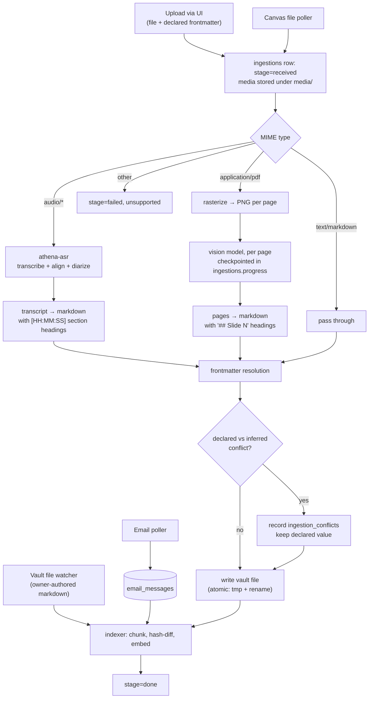

# 07 — Ingestion

Ingestion turns heterogeneous input into vault markdown with correct frontmatter, and
into rows the indexer can chunk. It is a job pipeline, not a request handler: a lecture
takes minutes, a slide deck takes tens of minutes on free-tier vision models.

## Pipeline



## Frontmatter resolution

The most consequential step, because `date` and `course` decide whether the acceptance
query works (see [`05-vault-schema.md`](05-vault-schema.md#the-date-field-is-load-bearing)).

Resolution order per field, first hit wins:

| Field | Order |
|---|---|
| `date` | declared → Canvas metadata → filename pattern → media file creation time → **fail** |
| `course` | declared → Canvas course → filename pattern → transcript content inference → **fail** |
| `title` | declared → first `# ` heading → Canvas name → filename stem |
| `sequence` | declared → filename pattern → `max(existing sequence for course) + 1` |
| `instructor` | declared → `_course.md` frontmatter → transcript speaker mapping |

`**fail**` means: the ingestion stops at `stage=failed` with a specific message, the UI
prompts for the missing field, and the owner supplies it. **It never defaults to today.**
A wrongly-dated lecture is invisible to the query that needs it and produces no error.

Everything Athena derived rather than received goes into
`documents.frontmatter.frontmatter_inferred` so the owner can audit the guesses.

## Audio → transcript

**Contract with `athena-asr`:**

```
POST /transcribe
  multipart: file, plus JSON options
  { "language": "en", "diarize": true, "word_timestamps": true,
    "model": "<asr-model-id>", "vad": true }

200 →
{
  "duration_s": 4920.4,
  "language": "en",
  "model": "<asr-model-id>",
  "segments": [
    { "id": 0, "start": 4.12, "end": 9.80, "speaker": "SPEAKER_00",
      "text": "All right, so last time we finished up with virtual memory",
      "words": [ { "word": "All", "start": 4.12, "end": 4.28, "score": 0.99 }, ... ] }
  ]
}
```

Implementation notes that matter:

- **VAD is not optional.** Whisper hallucinates during silence — it will confidently
  transcribe speech that is not there in a quiet lecture hall. Voice activity detection
  before decode is the mitigation, and it is one flag. `no_speech_threshold` discards
  low-confidence segments in quiet regions.
- **Word timestamps come from forced alignment, not the decoder.** Whisper's own segment
  timing drifts. A wav2vec2 alignment pass gives word-level timing accurate enough to
  seek audio from a citation.
- **Diarization and transcription use different models with different segmentations**,
  so their timecodes do not line up by construction. The correct assembly is: run
  diarization to get speaker turns, then assign each *aligned word* to the speaker whose
  turn contains its midpoint. Do not try to match segment boundaries — they will not
  match, and the resulting code is a pile of tolerance constants.
- **Long audio is chunked by the ASR service, not the caller.** A 90-minute file is
  processed in windows with overlap and stitched, with global timestamps.
- Speaker labels are `SPEAKER_00`-style. Mapping them to names is a separate,
  configurable step keyed on `_course.md`; the default assumption "the speaker with the
  most airtime in a lecture is the instructor" is a configurable heuristic, not a fact.

### Transcript → markdown

Section headings are emitted at topic boundaries so the heading-aware chunker has
structure to work with. Boundary detection is deterministic first — a silence gap longer
than `section_gap_s`, or a speaker change after a long instructor run — and only falls
back to a model call when configured, because "where does a topic start" is exactly the
kind of question that does not need an LLM most of the time (I-11).

```toml
# config/ingestion.toml
[audio]
base_url            = "http://host.docker.internal:8081"
model               = "<asr-model-id>"
language            = "en"
diarize             = true
word_timestamps     = true
vad                 = true
timeout_s           = 5400
section_gap_s       = 6.0
section_titles      = "heuristic"   # "heuristic" | "model" | "none"
speaker_map_source  = "course_file"
```

## PDF → markdown

Per D-12: rasterize, then convert each page with a vision model.

```toml
[pdf]
dpi                 = 150
max_pages           = 300
page_concurrency    = 2          # free-tier rate limits; see D-10
model_role          = "vision"
retry_per_page      = 3
checkpoint_every    = 1          # write progress after every page
```

Per-page prompt requirements (the prompt lives in `prompts/pdf_page.md`, not in code):

- Output markdown only, no preamble.
- Preserve headings, lists, tables, and code blocks as markdown structures.
- Transcribe code verbatim, including whitespace.
- Describe every figure in a blockquote beginning `**Figure.**`, stating what it shows,
  not what it means.
- If the page is blank or decorative, output nothing.

The assembler joins pages under `## Slide N — <page title>` headings. A page that failed
all retries is written as `## Slide N — conversion failed` with the page image path, so
the gap is visible rather than silently absent — that is I-12 at the document level.

**Checkpointing.** `ingestions.progress` holds `{"pages_done": n, "pages_total": m}` and
converted pages are written to a scratch area keyed by ingestion id. A job that dies at
page 40 of 60 resumes at 41. On free-tier models this is not an optimization, it is the
difference between a deck ever finishing and not.

## Canvas files

The poller lists files attached to assignments and modules only (K6 — not the whole
Files tab, which is textbooks). For each:

1. Upsert `canvas_files`. Skip when `canvas_updated_at` is unchanged and
   `download_state = 'converted'`.
2. Download to `media/`, preserving the Canvas filename.
3. Route by content type into the same converters as an upload.
4. Frontmatter is populated from Canvas metadata: `course` from the enrolment, `date`
   from the assignment due date or the file's `updated_at`, `canvas.*` from the API.

Size and type limits are configured; an oversize or unsupported file is recorded as
`download_state = 'skipped'` with a reason, and shows in the ingestion history.

## Email

Email is **not** written to the vault (see [`01-architecture.md`](01-architecture.md)).
The poller writes `email_messages` rows; the indexer chunks bodies from that table
directly with `source_type = 'email'`.

### The deterministic pre-filter

Runs before any model call, on every message (L3, I-11).

```toml
# config/accounts.toml
[email.prefilter]
default = "eligible"          # "eligible" | "ignored"

# Rules are evaluated in order; the first match decides and is recorded
# in email_messages.prefilter_rule.
[[email.prefilter.rules]]
id      = "bulk-mail"
action  = "ignored"
when    = { has_header = "List-Unsubscribe" }

[[email.prefilter.rules]]
id      = "noreply-senders"
action  = "ignored"
when    = { from_matches = ["^no-?reply@", "^donotreply@", "^bounce"] }

[[email.prefilter.rules]]
id      = "instructors"
action  = "eligible"
when    = { from_domain_in = ["osu.edu"] }

[[email.prefilter.rules]]
id      = "own-sent-mail"
action  = "ignored"
when    = { from_is_own_account = true }
```

Every rule has an `id` recorded on the message. "Why did Athena not surface this email"
is answerable by reading one column.

Only messages with `prefilter = 'eligible'` reach the triage model, which outputs one of
`no_action`, `needs_reply`, `calendar`, `informational` plus a confidence. Only
`needs_reply` and `calendar` produce agent work.

## What Athena still controls about chunking

OpenViking chunks and embeds (D-02). Athena influences chunking only through **document
structure**, which is worth being deliberate about because it is the whole lever:

| Source type | Structure Athena emits | Why |
|---|---|---|
| `lecture_transcript` | `## [HH:MM:SS]` section headings at topic boundaries; per-utterance timestamps in the body | Gives the chunker clean boundaries and lets a citation resolve to a moment |
| `slide_deck` | One `## Slide N — <title>` per page | One page per chunk falls out naturally; a citation can name a slide |
| `note`, `canvas_file` | The document's own heading tree, preserved | Headings are the boundaries |
| `email` | One rendered message per file | A thread becomes a directory |

Same reasoning as a hand-built chunker — structure carries the topical signal — but now
expressed in the markdown rather than in a strategy module. That is less code and more
visibility: if chunking is bad, the cause is readable in the vault file.

## Index submission

The indexer decides *what* to submit and *where it lives*. It does not chunk or embed.

<!-- verbatim -->
```python
# src/athena/ingestion/indexer.py


async def index_document(document_id: str, *, user_id: str) -> IndexResult:
    """Submit one vault document to OpenViking if its content has changed.

      1. Read the file; compute SHA-256 of the body.
      2. If the hash matches documents.content_hash AND indexed_at is set, skip.
      3. Map the vault path to a viking:// URI, preserving the directory
         structure exactly (see below -- this is the retrieval filter).
      4. Submit via RetrievalProvider.index(). OpenViking chunks, embeds, tiers.
      5. On success set content_hash, viking_uri, indexed_at and clear
         index_error. On failure record index_error and leave indexed_at NULL,
         so the catch-up job retries.

    Step 5 leaves the vault file untouched either way. A failed index must never
    block or roll back a vault write (I-01): the vault is the truth, the index
    catches up.
    """
```

### Path mapping

```
vault:  courses/cse-2431/lectures/2026/09/2026-09-08-lecture-03.md
viking: viking://resources/vault/courses/cse-2431/lectures/2026/09/2026-09-08-lecture-03.md
```

**The mapping is structure-preserving and MUST stay that way.** OpenViking scopes
retrieval by path prefix (D-02, D-03), so this tree *is* the filter index. Flattening it,
renaming a level, or introducing a hash-based path breaks date- and course-scoped
retrieval — and breaks it **silently**, because queries still return results, just from the
wrong scope.

A test asserts the round trip: every vault path maps to exactly one URI and back.

### Email and calendar

Not written to the vault (see [`01-architecture.md`](01-architecture.md)). The pollers
render eligible records as markdown into their own resource scopes:

```
viking://resources/email/<account>/2026/09/<message-id>.md
viking://resources/calendar/<calendar>/2026/09/<event-id>.md
```

Same `YYYY/MM/` nesting, so the same scope resolver covers them and "email from the week
of the midterm" is an ordinary path scope rather than a special case. Source of truth
remains the Postgres rows; these renderings are derived and rebuilt by `just reindex`.

### Removal

A deleted or renamed vault file must have its old URI removed, or a deleted note stays
answerable. The watcher emits a removal for a vanished path; the nightly catch-up
reconciles the full URI set against `documents` and removes orphans.

## Atomicity of vault writes

Vault files are written to a temporary file in the same directory and `os.replace()`d
into place. The rename is atomic on the same filesystem, so a watcher never sees a
half-written file and a crash never leaves a truncated note. The temp file is prefixed
`.athena-tmp-` and the watcher ignores that prefix.

## Failure handling

| Failure | Behaviour |
|---|---|
| ASR service unreachable | Job returns to queue with backoff. Media retained. Owner sees "waiting for transcription" (I-12 — no lower-quality fallback without being told). |
| Vision model rate-limited | Per-page retry with backoff; job requeued if the budget is exhausted; progress preserved. |
| Frontmatter unresolvable | `stage=failed`, specific message naming the field, UI prompts for it. |
| Embedding service down | Document written to the vault, `indexed_at` left NULL. Indexer catches up later. **The vault write is never blocked on the index** — that is I-01 in operation. |
| Conflicting frontmatter | Declared value used, conflict recorded and surfaced. |
| Duplicate upload (same content hash, same course, same date) | Rejected with a link to the existing document; the owner can force it. |
