# 08 — Retrieval

Retrieval is provided by **OpenViking**, running as a container alongside the rest of the
stack. Athena owns the vault, the ingestion that fills it, the tool contract the agent
sees, and the synthesis that produces cited answers. OpenViking owns chunking, embedding,
tiering, indexing, and search.

See [`03-decisions.md`](03-decisions.md#d-02--retrieval-openviking) for why.

## The query this is designed for

> "What did my instructor say about RAM in the lecture on September 8th?"

Decomposed:

1. A **hard scope**: only the CSE 2431 lecture of 2026-09-08. Non-negotiable — a chunk
   from a different lecture is wrong however similar.
2. A **similarity search inside that scope**.
3. A **synthesis** that quotes what was actually said, and cites where.

OpenViking's model fits this well, and the reason is worth understanding because it
determines how the vault must be laid out.

## Path is the filter

OpenViking organizes everything as a virtual filesystem under `viking://` URIs, and the
path is not metadata attached after indexing — it is an indexable scope boundary applied
**before** vector search and reranking. A query can be pinned to a subtree.

This means **the vault's directory structure is the filter index**. A path scope replaces
what would otherwise be a SQL `WHERE` clause, and it is evaluated at the same point in the
pipeline, which is the property that matters: the search runs over the restricted set
rather than over everything followed by a post-filter that collapses recall.

The consequence, and it is the main design change this decision forces:

**Date must be encoded in the path, hierarchically.**

```
viking://resources/vault/courses/cse-2431/lectures/2026/09/2026-09-08-lecture-03.md
```

Not `lectures/2026-09-08-lecture-03.md`. The nested `YYYY/MM/` is what makes a date range
expressible as a set of path scopes.

## Scope resolution

Athena does not ask the model to filter, and does not depend on OpenViking exposing
scalar date-range filters. It computes the scope set itself, in Python.

<!-- verbatim -->
```python
# src/athena/retrieval/scopes.py
from datetime import date


def resolve_scopes(
    *,
    course: str | None,
    date_from: date | None,
    date_to: date | None,
    source_types: list[str] | None,
) -> list[str]:
    """Turn a filter set into viking:// path scopes.

    This exists so retrieval correctness does not depend on OpenViking's scalar
    filter support, which is a moving target. A date range becomes a set of
    YYYY/MM path prefixes, computed from the calendar; a single date becomes a
    prefix down to the day. Everything narrower than a month is handled by
    scoping to the month and letting the search rank within it, which is a small
    enough candidate set that precision is unaffected.

    Widening rules:
      - no course  -> scope across every enrolled course's subtree
      - no date    -> scope to the course/type subtree
      - no type    -> scope to the course subtree

    The returned list is passed to recall as an explicit scope. An empty list is
    an error, never "search everything" -- silently widening a filter that failed
    to resolve is how a lecture query returns the wrong lecture.
    """
```

Because the vault layout, the enrolled course list, and the calendar are all things
Athena already knows, this is deterministic (I-11). Relative expressions — "last Tuesday's
lecture", "the lecture before the midterm" — resolve through
`src/athena/retrieval/dates.py` against the owner's timezone and the course's meeting
schedule from `_course.md`, before scopes are computed.

## Pipeline

```mermaid
flowchart LR
    Q["query + filters"] --> D["resolve dates<br/>(deterministic)"]
    D --> S["resolve scopes<br/>→ viking:// prefixes"]
    S --> R["OpenViking recall<br/>scoped semantic search"]
    R --> U["candidate URIs + abstracts"]
    U --> SEL["select URIs to open<br/>(bounded by config)"]
    SEL --> RD["OpenViking read<br/>L2 detail"]
    RD --> OFF["write bodies to<br/>/retrieved/{batch_id}/"]
    OFF --> HL["return compact hit list"]
    HL --> SUB["synthesis subagent"]
    SUB --> ANS["answer + citations"]
```



**Recall returns pointers, not payloads.** This is OpenViking's own contract — a recall
result is a list of `viking://` URIs plus short abstracts, and you then read the URIs you
want. That is the same two-stage shape I-09 requires, which is convenient: the offload
pattern is native rather than something Athena has to impose.

Athena still does the reading and the offloading itself, so the tool contract the agent
sees is Athena's, and I-05 and I-09 remain enforced in Athena's code rather than
delegated.

## The tool contract (I-09)

Unchanged from the previous design. The agent sees Athena's tool, not OpenViking's.

<!-- verbatim -->
```python
# src/athena/retrieval/schema.py
from pydantic import BaseModel, Field


class SearchHit(BaseModel):
    """One retrieval result as the ORCHESTRATOR sees it.

    Deliberately small. Full content is written to the batch directory and read
    by the synthesis subagent, never returned here (I-09). viking_uri is carried
    alongside vault_path so a citation can be resolved either way, and so a
    debugging session can go straight to `ov read`.
    """

    viking_uri: str
    vault_path: str
    title: str
    source_type: str
    content_date: str | None
    course: str | None
    locator: str  # "Slide 12" | "00:14:22-00:16:22" | "Lecture 03 > Cache Hierarchy"
    score: float
    preview: str = Field(max_length=200)


class SearchResult(BaseModel):
    batch_id: str
    batch_dir: str
    hits: list[SearchHit]
    scopes_searched: list[str]  # echoed back; see below
    total_candidates: int
    truncated: bool
```

`scopes_searched` is echoed deliberately. When the answer is "I found nothing," a
mis-resolved date is the most likely cause and is otherwise invisible to both the model
and the owner.

`search_vault` keeps its typed parameters — `course`, `date_from`, `date_to`,
`source_types`, `speaker`, `limit` — and translates them into scopes. The model supplies
the intent; the filter is applied as a scope, never as a post-hoc judgment over returned
chunks.

## Synthesis

Unchanged. Delegated to a subagent whose filesystem view is the batch directory only.

```python
class Citation(BaseModel):
    vault_path: str
    viking_uri: str
    locator: str
    quote: str | None  # verbatim, when the question is about wording


class SynthesisOutput(BaseModel):
    answer: str
    citations: list[Citation]
    insufficient: bool
```

I-05 is enforced structurally: `answer` non-empty with `citations` empty is rejected,
retried once, then surfaced as a failure. If the batch does not answer the question, the
subagent sets `insufficient` and the orchestrator reports that. Widening the scope and
searching again is permitted but must be visible to the owner, not silent.

The synthesis prompt requires verbatim quotation when the question is about what someone
said (I-02). Storing exact transcripts buys nothing if synthesis paraphrases them back.

## What Athena keeps out of OpenViking

OpenViking has an **auto-capture / agent-evolution** capability: it extracts memories from
sessions and commits them. It is disabled.

```jsonc
// openviking config
{ "evolution": { "enabled": false } }
```

Two reasons. First, I-02: extracted memories are the model's restatement, and the whole
reason the transcript is stored verbatim is that the flagship query is about wording.
Second, Athena's curated memory (`_athena/memories/`) is deliberately small,
human-readable, and agent-written under Athena's own rules; a second, opaque memory
channel writing in parallel makes "why does it think that" unanswerable.

OpenViking indexes what Athena puts in front of it. It does not learn on its own.

## What goes in

| Corpus | Viking scope | Written by |
|---|---|---|
| Vault markdown | `viking://resources/vault/...` mirroring the vault tree | ingestion worker, on index |
| Email bodies | `viking://resources/email/<account>/<YYYY>/<MM>/<message-id>.md` | email poller |
| Calendar events | `viking://resources/calendar/<calendar>/<YYYY>/<MM>/<event-id>.md` | calendar poller |

Email and calendar are rendered as markdown into their own resource scopes rather than
into the vault, for the same reason as before: the vault should be something the owner can
open in Obsidian and read, not a mail spool, and deleting an email should not require
reconciling a file removal.

Their date-hierarchical paths mean the same scope resolver covers them — "email from the
week of the midterm" is a path scope, not a special case.

## Embeddings stay local (D-05)

OpenViking is configured with an OpenAI-compatible embedding endpoint pointing at
Athena's own `athena-ml` service:

```jsonc
{
  "embedding": {
    "dense": {
      "provider":  "local",
      "api_base":  "http://athena-ml:8082/v1",
      "api_key":   "local",
      "model":     "<local-embedding-model-id>",
      "dimension": 1024
    }
  }
}
```

`athena-ml` therefore exposes an OpenAI-compatible `/v1/embeddings` route in addition to
its native one. This is the only change OpenViking forces on that service, and it keeps
the corpus on the machine.

**OpenViking's VLM configuration is a separate question and a real one.** Its semantic
processing (the L0/L1/L2 tiering) calls a vision/language model. Point it at OpenRouter —
the same accepted risk already recorded in
[`13-security.md`](13-security.md#known-accepted-risks) — or at a local model later. It is
configured explicitly in `config/retrieval.toml` so the choice is visible rather than
defaulted.

## Evaluation

Still required, and still Athena's (I do not take a vendor's retrieval quality on faith).

```
tests/fixtures/retrieval_eval/
├── corpus/             # ~10 synthetic documents across 3 courses and 6 dates
└── queries.yaml        # ~30 queries with expected source files
```

`queries.yaml` covers date-scoped lecture recall, exact-token queries (course codes, `L1`,
function names), paraphrase queries, cross-document queries, and **negative queries** the
corpus cannot answer.

Metrics: recall@20, precision@8, MRR, and the false-answer rate on negatives. The last
matters most — a system that answers negative queries confidently is worse than one that
misses, because you cannot tell when to distrust it.

`just eval-retrieval` runs the set against `baseline.json`. Any change to the vault
layout, the scope resolver, OpenViking's version, or its configuration MUST report the
delta in the pull request. Upgrading OpenViking is a retrieval change and is reviewed as
one.

## The fallback

The `RetrievalProvider` interface exists so this is reversible:

```python
class RetrievalProvider(Protocol):
    async def index(self, doc: IndexRequest) -> None: ...
    async def remove(self, uri: str) -> None: ...
    async def recall(self, query: str, *, scopes: list[str], limit: int) -> list[Candidate]: ...
    async def read(self, uri: str) -> str: ...
```

`OpenVikingProvider` is the implementation. If OpenViking proves unsuitable, the fallback
is the hand-built pgvector design recorded in
[`03-decisions.md`](03-decisions.md#d-19--superseded-the-hand-built-pgvector-design),
behind the same interface.

Because the vault is authoritative (I-01), switching is a reindex, not a migration. That
invariant is what makes this decision cheap to reverse, and it is the reason it was worth
its cost.
