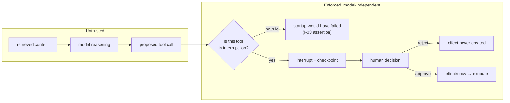

# 13 — Security

## Threat model

What Athena actually holds: the owner's full email across accounts, their calendar, their
coursework, and credentials that can send mail as them. What it can actually do: send
email, write calendar events. The realistic threats, in order of likelihood:

| # | Threat | Likelihood | Mitigation |
|---|---|---|---|
| 1 | **Prompt injection via ingested content** — an email, Canvas description, or PDF containing instructions the agent follows | High. This is the default state of the internet. | Approval boundary (I-03). Content-as-data prompting is defence in depth only. |
| 2 | **Agent acts on a misunderstanding** — sends the wrong thing to the wrong person | High | Approval boundary; summaries written for scannability; asymmetric approve/reject UX |
| 3 | **Credential leak into the repository** | Medium. Public repo. | I-07, `gitleaks` in CI and pre-commit, no secrets in config |
| 4 | **Path traversal into host files** | Medium | I-04, two independent walls |
| 5 | **Device on the tailnet reaching the UI** | Low | Session auth (D-17), Tailscale ACLs |
| 6 | **Supply chain** — a compromised dependency | Low, high impact | Locked dependencies, `pip-audit` in CI, no auto-updates, OpenViking pinned to an exact released tag |
| 7 | **Physical or local access to the Mac mini** | Low | Out of scope; FileVault is the owner's responsibility |

Threat 1 deserves the emphasis. Athena reads untrusted text — every email is written by
someone else — and hands it to a model that also receives its instructions as text. This
is not a solved problem, and no prompt fixes it. **The design assumption is that the model
will at some point be successfully injected.** Everything else follows from that.

## The approval boundary

The one control that holds when the model is compromised.



Properties that make it a control rather than a hope:

1. **Enforcement is structural.** The middleware pauses before the tool function is
   entered. The model is not asked to check anything.
2. **Absence of a rule is a startup failure**, not a default-allow. Adding a write tool
   without declaring an approval rule stops the process from booting.
3. **The decision is a database row**, not in-memory state. A restart cannot lose it or
   resolve it wrongly.
4. **Rejection is terminal for that call.** No retry loop, no "reformulate and try again"
   unless the model starts a new tool call, which interrupts again.
5. **Expiry resolves to reject** (D-13). The default outcome of inattention is inaction.

### What the boundary does not cover

Honesty about the gaps:

- **Read tools are not gated.** An injected agent can read all the owner's mail and put
  it into a vault file. It cannot exfiltrate it — `send_email` interrupts — but it can
  make a mess. Accepted: gating reads would make the system unusable.
- **An approved action is executed as described.** If the summary is misleading and the
  owner approves without expanding it, the boundary was bypassed by the human. This is
  why the summary is server-generated and why full arguments are always one tap away.
- **Auto-approval rules are a deliberate hole.** They are off by default, per action,
  argument-matched, and every auto-approved call is still audited and visible.

## Filesystem fencing

Two independent walls (I-04), because each has a known gap:

1. **`deepagents` `permissions`** — applied by `FilesystemMiddleware` at the tool level.
   Gap: does not cover direct backend use.
2. **`FilesystemBackend(root_dir=...)` plus `resolve_within_vault`** — resolves symlinks
   and rejects escapes before any I/O.

The API's vault viewer goes through the same `resolve_within_vault`. A traversal through
the file viewer is the same vulnerability as one through a tool, and it is easy to forget
that the HTTP layer needs the check too.

`config/`, `.env`, and the repository are outside the vault root and unreachable by
construction (I-15).

## Secrets

| Rule | Enforcement |
|---|---|
| Secrets only in env, from `.env` or Docker secrets | Pydantic validators reject value-shaped `*_env` fields and forbid `password`/`token`/`secret`/`api_key` keys |
| Never in logs | A `logging.Filter` redacting every known secret variable's value from every record, installed at process start in every entrypoint |
| Never in the vault or index | Vault writes go through the writer, which scans for known secret values |
| Never in the repository | `gitleaks` pre-commit hook and CI job |
| Never in SSE frames or the audit log | `audit_log.detail` carries entity references, not content; a test asserts no secret value appears in serialized events |
| Never in error responses | A global exception handler returns a correlation id; details go to logs |

Per-container credential scoping (D-08): `athena-mcp-email` receives mail credentials.
`athena-agent-worker` receives none of them — it reaches mail only through the MCP
server. Compose declares each service's environment explicitly; no service inherits the
full `.env`.

```yaml
# docker/compose.yml — the pattern, not the whole file
services:
  athena-mcp-email:
    environment:
      ATHENA_GMAIL_REFRESH_TOKEN:       # only here
      ATHENA_ICLOUD_APP_PASSWORD:       # only here
  athena-mcp-canvas:
    environment:
      ATHENA_CANVAS_TOKEN:              # only here
  athena-agent-worker:
    environment:
      ATHENA_OPENROUTER_API_KEY:        # model access only
      ATHENA_DATABASE_URL:
```

## Network

- No inbound ports on the router. No port forwarding, no reverse tunnel to a public host.
- Tailscale provides ingress; `tailscale serve` terminates TLS with a `*.ts.net`
  certificate and proxies to `athena-api`.
- Tailscale ACLs restrict which tailnet devices reach the service. Session auth (D-17) is
  the second layer, because a tailnet device is not the same thing as an authorized user.
- Containers are on an internal Compose network. Only `athena-api` is published, and only
  to `127.0.0.1` on the host, where `tailscale serve` picks it up. Nothing binds `0.0.0.0`.
- Egress: the MCP containers reach their providers, `athena-agent-worker` reaches
  OpenRouter, and nothing else needs the internet. `athena-ml` and `postgres` have no
  egress requirement.

## Prompt-injection mitigations, ranked by how much they are worth

1. **The approval boundary.** Load-bearing.
2. **Structural output schemas.** Synthesis returns typed objects with required
   citations; a model that has been talked into something still has to produce a valid
   object with real vault paths.
3. **No tool for widening permissions** (I-15). The agent cannot edit config, cannot add
   an auto-approve rule, cannot alter `interrupt_on`.
4. **Content-as-data prompting.** The orchestrator prompt states that retrieved content
   is data. Worth doing, worth roughly nothing on its own.
5. **Injection detection.** Not implemented. Pattern-matching for "ignore previous
   instructions" catches only the unsophisticated case and creates false confidence.

Required tests (Phase 12): a corpus of injection attempts embedded in email bodies,
Canvas assignment descriptions, and PDF content. The assertion is not that the model
resists them — it is that **no effect executes without an approval**, whatever the model
does.

## Audit

`audit_log` records: authentication attempts, approval decisions with the deciding user,
every effect with its outcome, config reloads with the fields that changed, credential
refresh failures, and every auto-approved action with the rule that approved it.

It records entity references and outcomes, never content or secrets. It is append-only —
no `UPDATE` or `DELETE` grants — and its retention is configurable and long by default.

## Backup and recovery

| Asset | Backup | Recovery |
|---|---|---|
| Vault | The owner's own backup of the volume; it is plain markdown and also git-friendly | Restore files; `just reindex` |
| `media/` | Volume backup; large | Restore; documents referencing missing media are flagged |
| Postgres state | `pg_dump` on a schedule to a mounted path | Restore dump |
| OpenViking store | **Not backed up.** Derived (I-01). | `just reindex --from-scratch` |
| Secrets | The owner's password manager. Never in a backup that leaves the machine. | Re-enter `.env` |

That the index is explicitly not backed up is worth stating: it is the practical payoff of
I-01. Recovery is "restore the markdown and rebuild," which is a much smaller promise to
keep than "restore a consistent vector database."

## Known accepted risks

Written down so they are decisions rather than oversights:

1. Free-tier model providers may retain prompts. **Embeddings are local (D-05), so the
   corpus as a whole is not transmitted — but two paths do transmit content.** Any
   document retrieved for a query is sent to OpenRouter for synthesis; and OpenViking's
   semantic tiering calls a VLM on ingested content, which by default is also OpenRouter.
   The levers, in increasing order of effort: point OpenViking's VLM at a local model,
   then the synthesis role.
2. App-specific passwords for iCloud grant full mailbox access and cannot be scoped. This
   is Apple's design; the mitigation is container isolation and rotation.
3. The Canvas token carries the owner's full Canvas privileges. Athena registers no
   Canvas write tool, so the blast radius is read, but the token itself is not scoped.
4. Docker Desktop on macOS runs a VM with broad host filesystem access as configured.
   Mounts are restricted to the vault, media, and models volumes.
